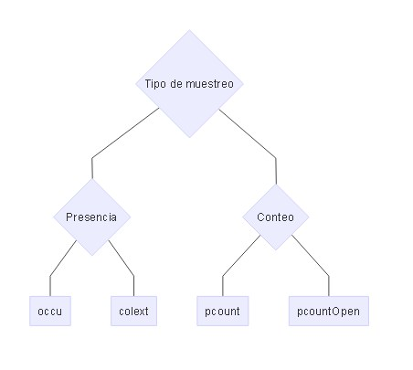
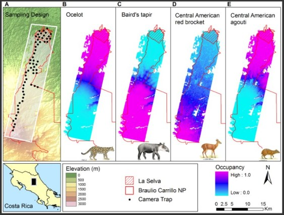
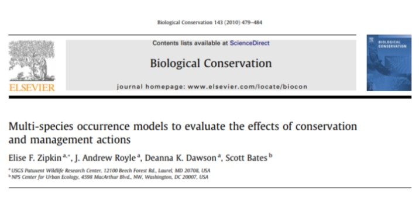
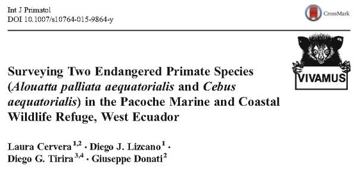

## Otros Tipos de modelos:

> - Single-season site occupancy model [(MacKenzie et al., 2002)](https://esajournals.onlinelibrary.wiley.com/doi/full/10.1890/0012-9658%282002%29083%5B2248%3AESORWD%5D2.0.CO%3B2).
> - Comunity occupancy model [(Kéry and Royle, 2007)](https://besjournals.onlinelibrary.wiley.com/doi/full/10.1111/j.1365-2664.2007.01441.x).
> - Royle-Nichols model [(Royle and Nichols, 2003)](https://esajournals.onlinelibrary.wiley.com/doi/full/10.1890/0012-9658%282003%29084%5B0777%3AEAFRPA%5D2.0.CO%3B2) -> abundancia en conteos puntuales. occuRN
> - Binomial N-mixture models [(Royle, 2004)](https://onlinelibrary.wiley.com/doi/full/10.1111/j.0006-341X.2004.00142.x) -> Conteos de individuos en localidades. Poblacin cerrada. pcount
> - Multinomial N-mixture models (Royle, 2004a) -> Conteos de individuos en localidades. Muestreo con remoción o doble observador. multinomPois
> - Distance sampling models [(Royle et al., 2004)](https://esajournals.onlinelibrary.wiley.com/doi/abs/10.1890/03-3127) -> Densidad en transectos de distancia con intervalo discreto. distsamp, 
> - “Open population” versions of the above: (MacKenzie et al., 2003; Chandler
et al., 2011; Dail and Madsen, 2011) ->pcountOpen, qdistsamp

---

## Árbol basico de decisión de modelos en el paquete unmarked



---


## [Un ejemplo: Ocupación dinamica, Trampas Cámara , Costa Rica, 5yr, Modelo Bayesiano. ](http://journals.plos.org/plosone/article?id=10.1371/journal.pone.0073707)

##### Ahumada JA, Hurtado J, Lizcano D (2013) Monitoring the status and trends of tropical forest terrestrial vertebrate communities from camera trap data: a tool for conservation. PLoS One 8:e73707. doi: 10.1371/journal.pone.0073707



---

## [Un ejemplo: Ocupación multiespecie.](https://www.researchgate.net/profile/Elise_Zipkin/publication/272819023_Zipkin_et_al_2010_Biol_Cons/links/54ef83710cf25f74d7227cee.pdf)

##### Zipkin, E. F., J. Andrew Royle, D. K. Dawson, and S. Bates. 2010. Multi-species occurrence models to evaluate the effects of conservation and management actions. Biological Conservation 143:479–484.



---


## [Un ejemplo: Distance Sampling con Unmarked y monos en Ecuador.](https://www.researchgate.net/publication/282611035_Surveying_Two_Endangered_Primate_Species_Alouatta_palliata_aequatorialis_and_Cebus_aequatorialis_in_the_Pacoche_Marine_and_Coastal_Wildlife_Refuge_West_Ecuador)

##### Cervera L, Lizcano DJ, Tirira DG, Donati G (2015) Surveying two endangered primate species (Alouatta palliata aequatorialis and Cebus aequatorialis) in the Pacoche Marine and Coastal Wildlife Refuge, West Ecuador. Int J Primatol. doi: 10.1007/s10764-015-9864-y




---

## Más modelos y ejemplos en el Libro de la libelula (2015).

#### Recientemente publicado [Marc Kery.](http://store.elsevier.com/Marc-Kery/ELS_1059944/) Junto con el volumen 2 que sale a final de este anio.


```{r eval=FALSE, include=FALSE}

---.segue bg:black

## Evaluando a su instructor.  


<q> 
Por favor ayudeme a mejorar este curso respondiendo [esta encuesta](https://es.surveymonkey.com/r/D286WDL) (8 minutos).  Todas las respuestas son anónimas.
</q> 


--- .segue #towork bg:url(assets/img/children-593313_1280.jpg)


```


## Espero que lo hayamos logrado! 


## Gracias...


--- .segue #towork bg:url(assets/img/Occu_Bayes.png)


