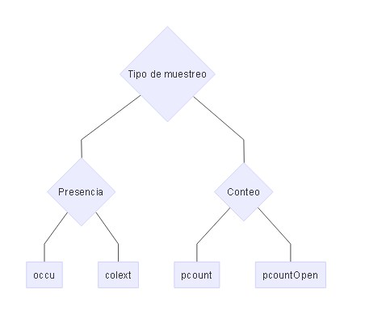
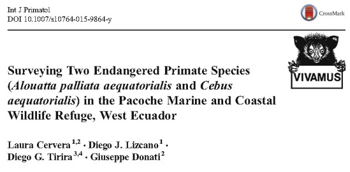

## Otros Tipos de modelos:

> - Single-season site occupancy model (MacKenzie et al., 2002)
> - Royle-Nichols model (Royle and Nichols, 2003) -> abundancia en conteos puntuales. occuRN
> - Binomial N-mixture models (Royle, 2004b) -> Conteos de individuos en localidades. Poblacion cerrada. pcount
> - Multinomial N-mixture models (Royle, 2004a) -> Conteos de individuos en localidades. Muestreo con remocion o doble observador. multinomPois
> - Distance sampling models (Royle et al., 2004) -> Densidad en transectos de distancia con intervalo discreto. distsamp, 
> - “Open population” versions of the above: (MacKenzie et al., 2003; Chandler
et al., 2011; Dail and Madsen, 2011) ->pcountOpen, qdistsamp

---

## Árbol basico de decisión de modelos en el paquete unmarked

---

## [Un ejemplo: Ocupacion dinamica, Camaras Trampa, Costa Rica, 5yr, Modelo Bayesiano. ](http://journals.plos.org/plosone/article?id=10.1371/journal.pone.0073707)

##### Ahumada JA, Hurtado J, Lizcano D (2013) Monitoring the status and trends of tropical forest terrestrial vertebrate communities from camera trap data: a tool for conservation. PLoS One 8:e73707. doi: 10.1371/journal.pone.0073707

---

## [Un ejemplo: Distance Sampling con Unmarked y monos en Ecuador.](https://www.researchgate.net/publication/282611035_Surveying_Two_Endangered_Primate_Species_Alouatta_palliata_aequatorialis_and_Cebus_aequatorialis_in_the_Pacoche_Marine_and_Coastal_Wildlife_Refuge_West_Ecuador)

##### Cervera L, Lizcano DJ, Tirira DG, Donati G (2015) Surveying two endangered primate species (Alouatta palliata aequatorialis and Cebus aequatorialis) in the Pacoche Marine and Coastal Wildlife Refuge, West Ecuador. Int J Primatol. doi: 10.1007/s10764-015-9864-y

---

## Mas modelos y ejemplos en el Libro de la libelula (2015).

#### Recientemente publicado [Marc Kery.](http://store.elsevier.com/Marc-Kery/ELS_1059944/) Junto con el volumen 2 que sale a final de este anio.

---.segue bg:black

## Evaluando a su instructor.  

<q> 
Por favor ayudeme a mejorar este curso respondiendo [esta encuesta](https://es.surveymonkey.com/r/QCRLXDP) (8 minutos).  Todas las respuestas son anónimas.
</q> 

--- .segue #towork bg:url(assets/img/children-593313_1280.jpg)

## Espero que lo hayamos logrado! 

## Gracias...

--- .segue #towork bg:url(assets/img/test.jpg)

## Evaluación

## Y ahora Uds. van a ser evaluados!

