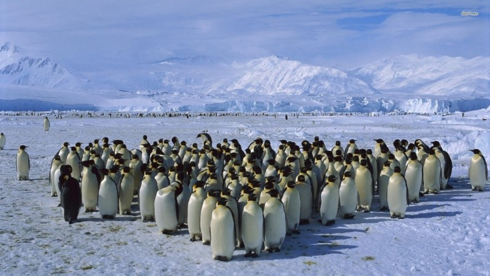
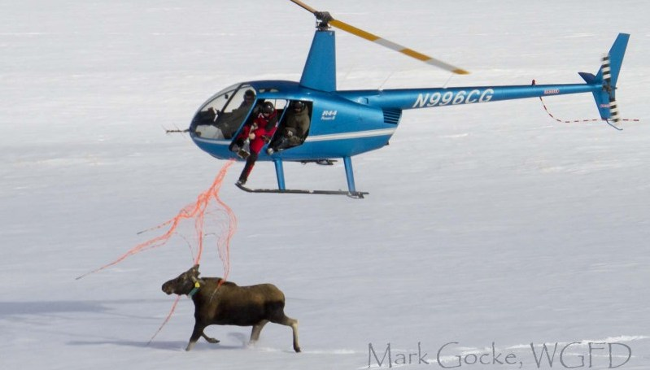

# About me


> - De: Cucuta, Colombia
> - [Biólogo (Uniandes, Bogotá)](https://cienciasbiologicas.uniandes.edu.co/)
> - [DICE, University of Kent](https://www.kent.ac.uk/dice/) 
> - Actualmente en: ULEAM, Manta
> - [Fauna de manabi](https://faunamanabi.github.io)
> - [TEAM Network](http://www.teamnetwork.org/user/1082)
> - [IUCN/SSC Tapir Specialist Group](http://www.tapirs.org/committees/index.html)
> - Mountain Tapir 
> - http://dlizcano.github.io
> - [@dlizcano en twitter](https://twitter.com/dlizcano)


---.segue bg:black

<q> 
La Ecología:  Estudio de las interacciones que determinan la _distribución y abundancia_.
</q> 

<p> 
 
</p>

## C. Krebs  

---

## Distribución y abundancia
  
### Donde estan y cuantos son 
  
Relacionado con el problema de contar animales en ecología

> - A diferencia de las plantas. Los animales se mueven!

---

# Contar Animales
  
  
#### Facil para animales que conspicuos que se agrupan.

---

# Contar Animales


#### No tan facil si no se agrupan. Metodos de Captura - Marca - Recaptura. Distance

---

# Contar Animales


#### Para algunas especies es engorroso, poco practico y muy costoso

---.segue bg:green

## Abundancia relativa: Una variable indicadora del estado de la población

---

## Los muestreos no son infalibles


#### La detectabilidad depende de:

> - 1. Las condiciones del muestreo (clima, hora)
> - 2. La habilidad del observador (sensor)
> - 3. La biología de la especie que se muestrea
> - Este error debe considerarse para evitar sesgos en las estimaciones de abundancia.

---.segue bg:black

## Mackenzie et al 2002, 2003, 2006 al rescate

--- &twocol

## Libro y programa presence

*** =left


*** =right


Populariza la ocupación ($\psi$) como proxi de la abundancia teniendo en cuenta la detectabilidad ($p$)

---

## La ocupación ($\psi$) y la probabilidad de detección ($p$)

> - 1. Proporción del área muestreada que esta ocupada por la especie.
> - 2. Visitando el sitio varias veces puedo estar mas seguro que detecto la especie.  
  
  
Así debería verse una tabla de datos con muestreos repetidos.
  

```{r eval=TRUE, echo=FALSE}
library(knitr)
muestreo<-c("visita 1","visita 2", "visita 3", "visita 4")
Sitio<-c("sitio 1", "sitio 2", "sitio 3", "sitio X")
mat<-matrix(c(1,0,1,0,
              0,0,1,0,
              0,0,0,0,
              1,0,0,0),nrow=4,ncol = 4)
colnames(mat)<-muestreo
rownames(mat)<-Sitio
kable(mat,booktabs=TRUE,longtable=TRUE)
```


--- &twocol

## Ejemplo del calculo de $\psi$ y $p$
  
### Método frecuentista (Máxima verosimilitud).
  
  
*** =left

```{r eval=TRUE, echo=FALSE}
library(knitr)
muestreo<-c("v 1","v 2", "v 3", "v 4")
Sitio<-c("s 1", "s 2", "s 3", "s X")
mat<-matrix(c(1,0,1,0,
              0,0,1,0,
              0,0,0,0,
              1,0,0,0),nrow=4,ncol = 4)
colnames(mat)<-muestreo
rownames(mat)<-Sitio
kable(mat,booktabs=TRUE)
```

*** =right


| **Historias de detección**                            |
|-------------------------------------------------------|
| Pr($H_{1}$=1001)= $\psi$ × p1(1–p2)(1–p3)p4           |
| Pr($H_{2}$=0000)= $\psi$ × (1–p2)(1–p2)(1–p3)(1–p4)p4 |
| Pr($H_{3}$=1100)= $\psi$ × p1p2(1–p3)(1–p4)           |  
| Pr($H_{x}$=0000)= $\psi$ × (1–p2)(1–p2)(1–p3)(1–p4)p4 |  

  


---

## Estas Historias se combinan en un solo modelo de maxima verosimilitud

| **Historias de detección**                            |
|-------------------------------------------------------|
| Pr($H_{1}$=1001)= $\psi$ × p1(1–p2)(1–p3)p4           |
| Pr($H_{2}$=0000)= $\psi$ × (1–p2)(1–p2)(1–p3)(1–p4)p4 |
| Pr($H_{3}$=1100)= $\psi$ × p1p2(1–p3)(1–p4)           |  
| Pr($H_{x}$=0000)= $\psi$ × (1–p2)(1–p2)(1–p3)(1–p4)p4 |  

<br />
<br />

$$
\begin{aligned}
L(\psi, p \mid H_{1},...,H_{x}) =  \prod_{i=1}^{x} Pr (H_{i})
\end{aligned}
$$
  
  
> - El modelo admite incorporar covariables para explicar $\psi$ y $p$

--- &twocol

## El mismo ejemplo del calculo de $\psi$ y $p$
  
### Método Bayesiano.
  
  
*** =left

```{r eval=TRUE, echo=FALSE}
library(knitr)
muestreo<-c("v 1","v 2", "v 3", "v 4")
Sitio<-c("s 1", "s 2", "s 3", "s X")
mat<-matrix(c(1,0,1,0,
              0,0,1,0,
              0,0,0,0,
              1,0,0,0),nrow=4,ncol = 4)
colnames(mat)<-muestreo
rownames(mat)<-Sitio
kable(mat,booktabs=TRUE)
```

*** =right
 
Es importante entender que hay dos procesos que se pueden modelar de forma jerarquica.
  
> - El proceso ecologico ($\psi$) sigue una distribucion Bernoulli.
> - El modelo de observacion ($p$) sigue una distribucion Bernoulli.
> - La probabilidad de observar la especie dada que esta presente: $p$=Pr($y_{i}$=1 $\mid$ $z_{i}$=1)
> - La probabilidad de ocurrencia: $\psi$ =Pr($z_{i}$=1)

---

## Un modelo jerarquico 
  


### Admite covariables

--- &twocol

## Cual uso? Maxima verosimilitud o Bayesiano?
  
  
*** =left

### ML

> - Paquete unmarked en R
> - Admite seleccion "automatica" de modelos con AIC
> - Problemas con matrices que tienen muchos NAs
> - Problema Hesian y estimados ok.

*** =right
 
### Bayesiano

> - Lenguaje BUGS o Stan, llamado desde R
> - La seleccion de modelos no es tan sencilla, BIC no es adecuado
> - No tiene tantos problemas con muchos NAs en la matriz  
> - Los estimados son mas precisos.

---


