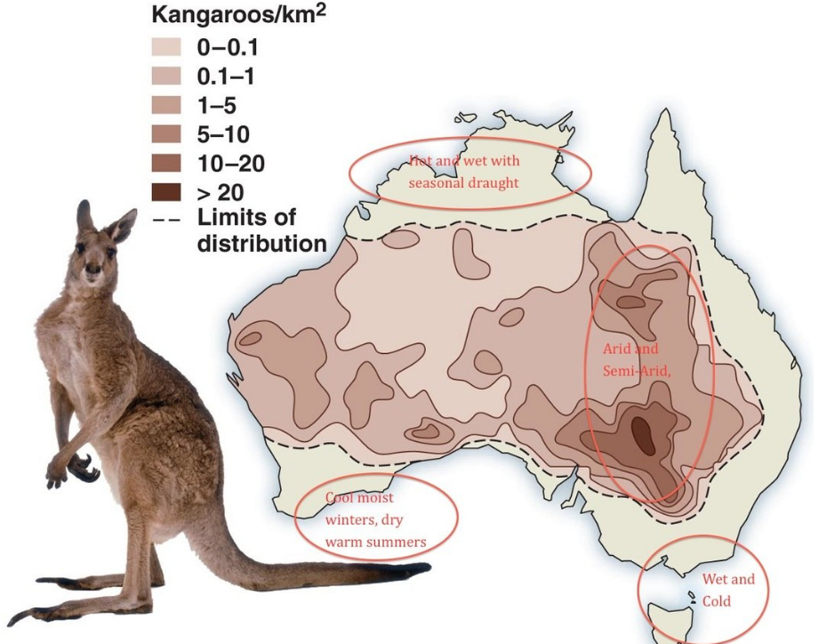
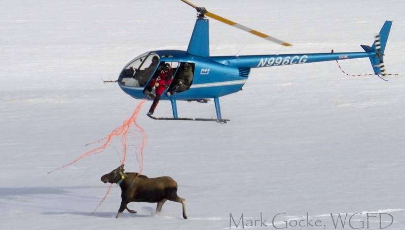
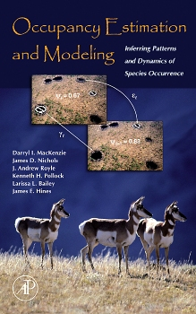

 

## Gracias Prof. Francisco, Fabian y Gabriela
 

Quienes han hecho posible este curso !

---.segue .centrepre .bigger bg:black

## Descargar Diapositivas de:

## https://goo.gl/A6e9hr

---

# About me

> - De: Cucuta, Colombia
> - [Biólogo (Uniandes, Bogotá)](https://cienciasbiologicas.uniandes.edu.co/)
> - [DICE, University of Kent, UK](https://www.kent.ac.uk/dice/) 
> - Actualmente en: TNC, Bogota.
> - [ULEAM, Fauna de manabi](https://faunamanabi.github.io)
> - [TEAM Network](http://www.teamnetwork.org/user/1082)
> - [IUCN/SSC Tapir Specialist Group](http://www.tapirs.org/committees/index.html)
> - Mountain Tapir 
> - http://dlizcano.github.io
> - [<i class="fa fa-twitter" aria-hidden="true" fa-3x></i> @dlizcano en twitter](https://twitter.com/dlizcano) 

---.segue bg:black

<q> 
La Ecología:  Estudio de las interacciones que determinan la __distribución y abundancia__.
</q> 

 
 

### [Charles. Krebs] (https://www.amazon.com/Charles-J.-Krebs/e/B001ITXN5Q/ref=dp_byline_cont_book_1) 

---

# Distribución y abundancia
  
## Donde están los organismos y cuantos son ?
  
### Relacionado con el problema de contar animales en ecología

> - A diferencia de las plantas... 
> - Los animales se mueven!
> - 

---

## El mapa que todos queremos!

#### Hay que contar los canguros

---

# Contar Animales
  
  
#### Facil para animales que conspicuos que se agrupan.

---

# Contar Animales

#### No tan facil si no se agrupan. Metodos de Captura - Marca - Recaptura. Distance

---

# Contar Animales

#### Para algunas especies es engorroso, poco practico y muy costoso

---.segue bg:green

## Abundancia relativa: Una variable indicadora del estado de la población

---.vcenter bg:url(assets/img/bird_abundance.jpg)

## No se cuantos hay pero si donde hay mas y donde hay menos.

##### http://www.stateofthebirds.org/2016/resources/species-abundance-maps/wood-thrush/#_ga=1.58268970.1097663810.1456855475

---.segue bg:gray
## Pero debo tener en cuenta que: 

---
## Los muestreos no son infalibles

### La detectabilidad, una combinacion de factores que depende de:

> - 1. Las condiciones del muestreo (clima, hora)
> - 2. La habilidad del observador (sensor)
> - 3. La biología de la especie que se muestrea
> - Este error debe considerarse para evitar sesgos en las estimaciones de abundancia.

---

## Como ocurre el error de detección

Es un error importante que debe considerarse en los muestreos!!! 

---

# Mackenzie et al 2002, 2003 al rescate

--- &twocol

## Libro y programa presence (2006)

*** =left

*** =right

Populariza la ocupación ($\psi$) como proxi de la abundancia teniendo en cuenta la detectabilidad ($p$)

---

# La ocupación en acción.

## [Wildlife Coservation Society, WCS](http://global.wcs.org/Our-Impact/Species.aspx)
## [Advances and applications of occupancy models,  MEE](http://onlinelibrary.wiley.com/doi/10.1111/2041-210X.12100/abstract)
## [Detecting diversity, TrEE](https://nature.berkeley.edu/beislab/BeissingerLab/publications/Iknayan_etal_2014_TREE_nocover.pdf)
##[Modelling of species distributions, under imperfect detection, MEE](http://onlinelibrary.wiley.com/doi/10.1111/ecog.02445/full)

---

## Permite establecer metas y monitorearlas en el tiempo.

---

## La ocupación ($\psi$) y la probabilidad de detección ($p$)

### La ocupación ($\psi$) que es un reflejo de otros parámetros poblacionales importantes como la densidad. 

> - 1. ($\psi$) es la proporción del área muestreada que está ocupada por la especie.
> - 2. Visitando el sitio varias veces puedo estar mas seguro que detecto la especie cuando esta se encuentra en ese lugar. 
> - 3. Los __muestreos repetidos__ son clave.
  
###  ($\psi$) esta influenciada por variables ambientales  (__Covariables__) como cobertura vegetal, altitud, precipitacion, etc.

---

## Así debería verse una tabla de datos con muestreos repetidos.
  

|        | visita 1| visita 2| visita 3| visita 4|
|:-------|--------:|--------:|--------:|--------:|
|sitio 1 |        1|        0|        0|        1|
|sitio 2 |        0|        0|        0|        0|
|sitio 3 |        1|        1|        0|        0|
|sitio X |        0|        0|        0|        0|

--- &twocol

## Ejemplo del calculo de $\psi$ y $p$
  
### Método frecuentista (Máxima verosimilitud).
  
  
*** =left

|    | v 1| v 2| v 3| v 4|
|:---|---:|---:|---:|---:|
|s 1 |   1|   0|   0|   1|
|s 2 |   0|   0|   0|   0|
|s 3 |   1|   1|   0|   0|
|s X |   0|   0|   0|   0|

*** =right

| **Historias de detección**                            |
|-------------------------------------------------------|
| Pr($H_{1}$=1001)= $\psi$ × p1(1–p2)(1–p3)p4           |
| Pr($H_{2}$=0000)= $\psi$ × (1–p2)(1–p2)(1–p3)(1–p4)p4 |
| Pr($H_{3}$=1100)= $\psi$ × p1p2(1–p3)(1–p4)           |  
| Pr($H_{x}$=0000)= $\psi$ × (1–p2)(1–p2)(1–p3)(1–p4)p4 |  

  

---

## Estas Historias se combinan en un solo modelo de maxima verosimilitud

| **Historias de detección**                            |
|-------------------------------------------------------|
| Pr($H_{1}$=1001)= $\psi$ × p1(1–p2)(1–p3)p4           |
| Pr($H_{2}$=0000)= $\psi$ × (1–p2)(1–p2)(1–p3)(1–p4)p4 |
| Pr($H_{3}$=1100)= $\psi$ × p1p2(1–p3)(1–p4)           |  
| Pr($H_{x}$=0000)= $\psi$ × (1–p2)(1–p2)(1–p3)(1–p4)p4 |  

 
 

$$
\begin{aligned}
L(\psi, p \mid H_{1},...,H_{x}) =  \prod_{i=1}^{x} Pr (H_{i})
\end{aligned}
$$
  
  
> - El modelo admite incorporar covariables para explicar $\psi$ y $p$

--- &twocol

## El mismo ejemplo del calculo de $\psi$ y $p$
  
### Método Bayesiano.
  
  
*** =left

|    | v 1| v 2| v 3| v 4|
|:---|---:|---:|---:|---:|
|s 1 |   1|   0|   0|   1|
|s 2 |   0|   0|   0|   0|
|s 3 |   1|   1|   0|   0|
|s X |   0|   0|   0|   0|

*** =right
 
Es importante entender que hay dos procesos que se pueden modelar de forma jerarquica.
  
> - El proceso ecológico ($\psi$) sigue una distribución Bernoulli.
> - El modelo de observación ($p$) sigue una distribución Bernoulli.
> - La probabilidad de observar la especie dada que esta presente: $p$=Pr($y_{i}$=1 $\mid$ $z_{i}$=1)
> - La probabilidad de ocurrencia: $\psi$ =Pr($z_{i}$=1)

---

## Un modelo jerarquico (Bayesiano)
  

### Admite covariables

--- &twocol

## Cual uso? Maxima verosimilitud o Bayesiano?
  
  
*** =left

### ML

> - Paquete [unmarked](https://cran.r-project.org/web/packages/unmarked/index.html) en R
> - Admite seleccion "automatica" de modelos con AIC
> - Problemas con matrices que tienen muchos NAs
> - Problema Hesian y estimados ok.
> - Dificultad de 1 a 10: 3 si ya sabes R.

*** =right
 
### Bayesiano

> - Lenguaje BUGS o Stan, llamado desde R
> - La seleccion de modelos no es tan sencilla, BIC no es adecuado
> - No tiene tantos problemas con muchos NAs en la matriz  
> - Los estimados son mas precisos.
> - Dificultad de 1 a 10: 7 si ya sabes R.

---.segue bg:#202020

## De donde vienen los modelos jerarquicos? 

--- &twocol

## [Andy Royle](http://www.pwrc.usgs.gov/staff/profiles/documents/royle.htm) 
  

  
*** =left

Padre junto con (James Nichols and Darryl MacKenzie) de los modelos de ocupación

*** =right

### Autor del libro azul (2008).
  

Libro de nivel avanzado con muchos detalles, formulas, ejemplos y código en R y lenguaje BUGS.

--- &twocol

## Libro de la libelula (2015).

#### Recientemente publicado con [Marc Kery](http://store.elsevier.com/Marc-Kery/ELS_1059944/).

*** =left  

*** =right

Mas de 700 paginas explicando claramente de donde viene la teoria, en estilo tutorial, comenzando con un nivel basico de R hasta modelos avanzados y su implementacion en R y lenguaje BUGS.  

  
<a class="btn btn-large btn-danger" rel="popover" data-content="No. Hay modelos jerarquicos que no son Bayesianos." data-original-title="A Title" id='example'>Son todos los modelos jerarquicos Bayesianos ?</a>

--- #alfinal bg:url(assets/img/baby-84626_1280.jpg)

## Manos a la obra!

  

> - Nivel?
> - Objetos?, Vectores?, DataFrame?
> - Loops?, Funciones?

--- &twocol

## Cronograma

*** =left 

| Día         |  Tema                                          |
|-------------|------------------------------------------------|
|Viernes      | 1. Introducción a R                            |
|             | 2. [R como herramienta de modelado](https://dlizcano.github.io/IntroOccuPresent/R_toModel.html)               |
|Viernes      | 3. [El concepto de ocupación y su modelado](https://dlizcano.github.io/IntroOccuPresent/modelOccuData.html)            |
|             | 4. Modelo occu. estático - [ unmarked101](https://dlizcano.github.io/IntroOccuPresent/unmarked_101.html)          | 
|Sab Mañ      | 5. Modelo occu. estático - [Sim Machalilla](https://dlizcano.github.io/IntroOccuBook/)       |
|             | 6. Modelo occu. estático - [Unm Machalilla](https://dlizcano.github.io/IntroOccuBook/unmarked.html#poniendo-los-datos-en-unmarked)      |
|Sab Tar      | _7. Modelo occu. estático - Bayes Machalilla_  |
|             | 9. Preguntas y Datos del mundo real - [Pecari](https://github.com/dlizcano/IntroOccuPresent/raw/gh-pages/code/Pecari.rar)   |
|             | 10. [Otros modelos jerárquicos](https://dlizcano.github.io/IntroOccuPresent/Otros_modelos_jerarquicos.html)      |

*** =right

--- .segue #towork bg:url(assets/img/children-593313_1280.jpg)

## Al final: Modelo de ocupacion-detección... (Bayesiano espacial).

