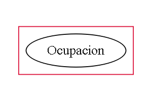
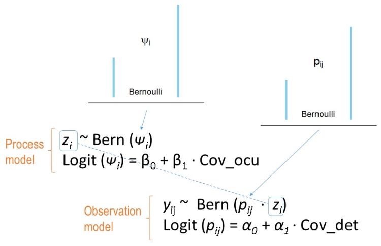

## Modelos y simulaciones en ecología

> - Un modelo en ecología es la descripción matemática de un sistema ecológico. 

> - Cuando la descripción se hace con un propósito practico se llama simulación.  

> -  Mas sobre [modelos en ecología](http://www.planta.cn/forum/files_planta/an_introduction_to_mathematical_models_in_ecology_336.pdf)


--- &twocol

## Las simulaciones son versiones simplificadas de un sistema real, en el cual podemos probar como varían ciertos parámetros, que afectan los estimados de otros parámetros.  


*** =left

```
All models are wrong but some are useful.
George Box, 1978. British statistician.
Statististics prof. Univ Princeton
Student of Egon Pearson
Box-Cox transformation
```

Mas sobre [George Box](https://en.wikipedia.org/wiki/George_E._P._Box) 

*** =right


--- &twocol

# Por que son útiles las simulaciones:


*** =left


> - Conozco los parámetros verdaderos.
> - Son una buena forma de aprender.
> - Podemos calibrar un modelo. 
> - Al ser capaces de simular datos bajo cierto modelo, se garantiza que uno entiende el modelo, sus restricciones y limitaciones.
> - Permiten verificar la calidad de los estimados, así como la precisión y el efecto del tamaño muestral.
> - Podemos visualizar que tan identificables son los parámetros en modelos más complejos.

*** =right

```{r statmodel, echo=FALSE, cache=TRUE, fig.height=4, fig.width=4.5, message=FALSE, warning=FALSE}

set.seed(1234)
da<-data.frame(estimado=rnorm(1000, 0.6, 0.05))
library(ggplot2)


ggplot(da, aes(x=estimado)) + 
    geom_histogram(aes(y=..density..),      # Histogram with density 
                   binwidth=.01,
                   colour="black", fill="white") +
    geom_density(alpha=.2, fill="#FF6666") + 
    geom_vline(aes(xintercept=mean(estimado, na.rm=T)),   # Ignore NA values for mean
               color="blue", linetype="dashed", size=1)

```

---.segue bg:black


## Vamos a realizar una simulación de la ocupación ($\psi$) y la detectabilidad (_p_).    

---.segue bg:black


## Imitar la forma como se originan las medidas de interes. La ocupación ($\psi$) y la detectabilidad (_p_).  

## Aproximación mecanistica (mecanismo).


--- &twocol

# Hay dos procesos

*** =left

## Proc. ecológico _z_. 

El cual gobierna la presencia de la especie.  
> - La especie está (_z_=1), o no está (_z_=0) en el sitio. Simulado a partir de una distribución Bernoulli. 

```{r occumodel, echo=FALSE, cache=TRUE, fig.height=3, fig.width=3.5, message=FALSE, warning=FALSE}


daoc<-data.frame(estimado=rbinom(500, 1, 0.25))

ggplot(daoc, aes(x=estimado)) + 
    geom_histogram(aes(y=..density..),      # Histogram with density 
                   binwidth=.1,
                   colour="black", fill="white") +
    #geom_density(alpha=.2, fill="#FF6666") + 
    geom_vline(aes(xintercept=mean(estimado, na.rm=T)),   # Ignore NA values for mean
               color="blue", linetype="dashed", size=1)

```


*** =right


## Proc. de observación _y_.

El cual gobierna la observación de la especie.
> - La especie se observa (_p_=1), si es que la especie esta presente. Prob. condicional. Simulado con una distribución Bernoulli. 


```{r obsmodel, echo=FALSE, cache=TRUE, fig.height=3, fig.width=3.5, message=FALSE, warning=FALSE}


daob<-data.frame(estimado=rbinom(500, 1, 0.75))

ggplot(daob, aes(x=estimado)) + 
    geom_histogram(aes(y=..density..),      # Histogram with density 
                   binwidth=.1,
                   colour="black", fill="white") +
    #geom_density(alpha=.2, fill="#FF6666") + 
    geom_vline(aes(xintercept=mean(estimado, na.rm=T)),   # Ignore NA values for mean
               color="blue", linetype="dashed", size=1)

```

---

## Es importante entender que ambos procesos que se enlazan forma jerarquica.




> -  El proceso ecológico ($\psi$) sigue una distribución Bernoulli.

> -  El modelo de observación ($p$) sigue una distribución Bernoulli.  

> -  La probabilidad de ocurrencia tambien es tambien una proporcion (ocupación):   

$\psi$ = Pr($z_{i}$=1)  

> -  La probabilidad de observar la especie dado que la especie esta presente es:    

$p$ = Pr($y_{i}$=1 $\mid$ $z_{i}$=1)  


---

## Ahora jugemos un poco con la distribución Bernoulli

### Es una variación de la distribución binomial

#### Variemos ni y pi y observemos como la media estimada (azul) se acerca a pi

```{r bernplay, eval=FALSE, echo=TRUE, cache=FALSE, fig.height=2.5, fig.width=5, message=FALSE, warning=FALSE}

ni<-10 # numero de datos
pi<- 0.5 # probabilidad (~proporcion de unos)
# Generemos datos con esa informacion 
daber<-data.frame(estimado=rbinom(ni, 1, pi)) 
# Grafiquemos 
library(ggplot2)
ggplot(daber, aes(x=estimado)) + 
    geom_histogram(aes(y=..density..), # Histograma y densidad 
                   binwidth=.1, # Ancho del bin
                   colour="black", fill="white") + 
        geom_vline(aes(xintercept=mean(estimado, na.rm=T)), 
          color="blue", linetype="dashed", size=1) # media en azul

```


---.segue bg:#202020

## Cambiemos la aproximación. Estudiemos la relación a partir de los datos y las covariables

--- &twocol

## Relación parametros y covariables


*** =left

### Ocupación y covariables

> -  La ocupación ($\psi$) es un conjunto de 1s y 0s.  

> -  Las covariables pueden ser continuas o discretas.  


```{r table1, message=FALSE, warning=FALSE, echo=FALSE}
library(knitr)
sitio<-c(1:5)
psi<-c(1,0,1,0,0)
cov1<-c(10,15,20,30,40)
cov2<-c(1.5, 1.1, 5.5, 2.1, 2.2)
cov3<-c("bosque", "cafe", "bosque", "cacao", "bosque")
table1<-cbind(sitio, psi, cov1, cov2, cov3)
kable(table1)
```

#### Regresión logistica

*** =right

### Observación y covariables

> -  La Observaciones son un conjunto de 1s y 0s.  

> -  Las covariables pueden ser continuas o discretas. 


```{r table2, eval=TRUE, echo=FALSE, cache=FALSE, fig.height=2.5, fig.width=5, message=FALSE, warning=FALSE}
library(knitr)
#sitio<-c(1:5)
obs<-c(1,0,1,0,0)
cov1<-c(10,15,20,30,40)
cov2<-c(1.5, 1.1, 5.5, 2.1, 2.2)
cov3<-c("nublado", "soleado", "nublado", "nublado", "soleado")
table2<-cbind(obs, cov1, cov2, cov3)
kable(table2)
```

#### Regresión logistica

--- &twocol

## Regresión logistica


```{r logist,  eval=TRUE, echo=TRUE, cache=FALSE, fig.height=4.5, fig.width=5, message=FALSE, warning=FALSE}
data(mtcars)
obs<-mtcars$vs
cov1<-mtcars$mpg
table3<-cbind.data.frame (obs,cov1)
library(ggplot2)
ggplot(table3, aes(x=cov1, y=obs)) + geom_point() + 
  geom_smooth(method = "glm", method.args = list(family = "binomial"))
```


---.hundred50
# Regresión logistica permite encontrar la relación entre una variable binaria y covariables.


La regresion logistica tiene la forma:

$y = { 1 \over 1 + e^{ -(\alpha + \beta_1 X_1 + \beta_2 X_2 + \cdots + \beta_p X_p + \epsilon) } }$

Aplicando el "truco algebraico" de la funcion logit, adopta la forma:

$ logit(y) = \alpha + \beta_1 X_1 + \beta_2 X_2 + \cdots + \beta_p X_p + \epsilon$

--- 

## Poniendo todo junto...

  

> - Pasar a modelo occu en unmarked


--- &twocol

## Cronograma

*** =left 

| Día         |  Tema                                          |
|-------------|------------------------------------------------|
|Jueves       | 1. Introducción a R                            |
|             | 2. R como herramienta de modelado              |
|Viernes      | 3. El concepto de ocupación y su modelado      |
|             | 4. Modelo occu. estático - [ unmarked101](https://dlizcano.github.io/IntroOccuPresent/unmarked_101.html#1)        |
|Sab Mañ      | 5. Modelo occu. estático - Sim Machalilla      |
|             | 6. Modelo occu. estático - Unm Machalilla      |
|Sab Tar      | 7. Modelo occu. estático - Bayes Machalilla    |
|Dom Mañ      | 8. Modelo occu. dinámico - Unmarked            |
|             | 9. Preguntas y Datos del mundo real - Pecari   |
|Dom Tar      | 10. Otros modelos jerárquicos - Evaluación     |


*** =right


--- .segue #towork bg:url(assets/img/children-593313_1280.jpg)

## Al final: Modelo de ocupacion Bayesiano espacial.


