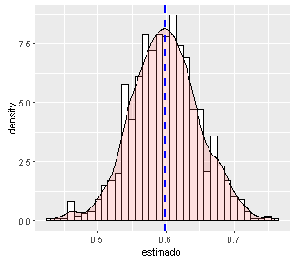
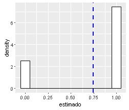
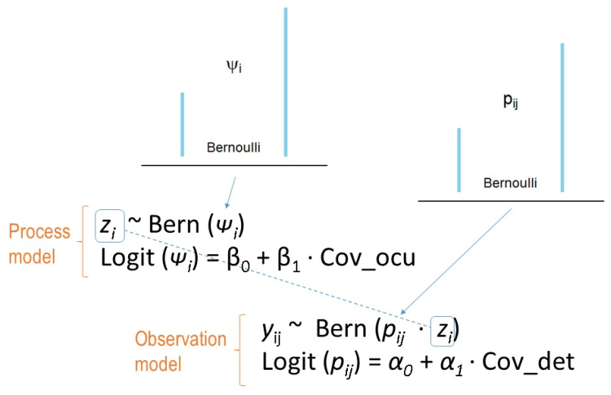

# Simulaciones y modelos

--- &twocol

## Las simulaciones son versiones simplificadas de un sistema real, en el cual podemos probar como varían ciertos parámetros que afectan los estimados de otros parámetros.  


*** =left

```
All models are wrong but some are useful.
George Box, 1978
```

*** =right


--- &twocol

# Por que son útiles las simulaciones:


*** =left


> - Conozco los parámetros verdaderos.
> - Son una buena forma de aprender.
> - Podemos calibrar un modelo. 
> - Al ser capaces de simular datos bajo cierto modelo, se garantiza que uno entiende el modelo, sus restricciones y limitaciones.

*** =right




---.segue bg:black


## Imitar la forma como se originan las medidas de interes. La ocupación ($\psi$) y la detectabilidad (_p_).  

### Aproximación mecanistica (mecanismo).


--- &twocol

# Hay dos procesos

*** =left

## Proc. ecológico _z_. 

El cual gobierna la presencia de la especie.  
La especie está (_z_=1), o no está (_z_=0) en el lugar. Simulado a partir de una distribución Bernoulli. 


*** =right


## Proc. de observación _y_.

El cual gobierna la observación de la especie.
La especie se observa (_p_=1), si es que la especie esta. Prob. condicional. Simulado con una distribución Bernoulli por el proceso ecologico. 




---

## Es importante entender que ambos procesos que se enlazan forma jerarquica.


### El proceso ecológico ($\psi$) sigue una distribución Bernoulli.
### El modelo de observación ($p$) sigue una distribución Bernoulli.  

La probabilidad de ocurrencia, es tambien una proporcion (ocupación):   

$\psi$ = Pr($z_{i}$=1)  

La probabilidad de observar la especie dado que la especie esta presente es:    

$p$ = Pr($y_{i}$=1 $\mid$ $z_{i}$=1)  


---

## Ahora jugemos un poco con la distribución Bernoulli

### Es una variación de la distribución binomial

#### Variemos ni y pi y observemos como la media estimada (azul) se acerca a pi


```r
ni<-10 # numero de datos
pi<- 0.5 # probabilidad (~proporcion de unos)
# Generemos datos con esa informacion 
daber<-data.frame(estimado=rbinom(ni, 1, pi)) 
# Grafiquemos 
library(ggplot2)
ggplot(daber, aes(x=estimado)) + 
    geom_histogram(aes(y=..density..), # Histograma y densidad 
                   binwidth=.1, # Ancho del bin
                   colour="black", fill="white") + 
        geom_vline(aes(xintercept=mean(estimado, na.rm=T)), 
          color="blue", linetype="dashed", size=1) # media en azul
```


---.segue bg:#202020

## Cambiemos la aproximación. Estudiemos la relación a partir de los datos y las covariables

--- &twocol

## Relación parametros y covariables


*** =left

### Ocupación y covariables

La ocupación ($\psi$) es un conjunto de 1s y 0s.  

Las covariables pueden ser continuas o discretas.  


|sitio |psi |cov1 |cov2 |cov3   |
|:-----|:---|:----|:----|:------|
|1     |1   |10   |1.5  |bosque |
|2     |0   |15   |1.1  |cafe   |
|3     |1   |20   |5.5  |bosque |
|4     |0   |30   |2.1  |cacao  |
|5     |0   |40   |2.2  |bosque |

#### Regresión logistica

*** =right

### Observación y covariables

La Observaciones son un conjunto de 1s y 0s.  

Las covariables pueden ser continuas o discretas. 


|obs |cov1 |cov2 |cov3    |
|:---|:----|:----|:-------|
|1   |10   |1.5  |nublado |
|0   |15   |1.1  |soleado |
|1   |20   |5.5  |nublado |
|0   |30   |2.1  |nublado |
|0   |40   |2.2  |soleado |

#### Regresión logistica

--- &twocol

## Regresión logistica


```r
data(mtcars)
obs<-mtcars$vs
cov1<-mtcars$mpg
table3<-cbind.data.frame (obs,cov1)
library(ggplot2)
ggplot(table3, aes(x=cov1, y=obs)) + geom_point() + 
  geom_smooth(method = "glm", method.args = list(family = "binomial"))
```


---

# Regresión logistica permite encontrar la relación entre una variable binaria y covariables


--- 

## Poniendo todo junto

  

> - Pasar a SimulMachalilla


--- &twocol

## Cronograma

*** =left 

| Día-jornada |                                                |
|-------------|------------------------------------------------|
|Jue Mañana   | 1. Introducción a R                            |
|             | 2. R como herramienta de modelado              |
|Jue Tarde    | 3. El concepto de ocupación y su modelado      |
|             | 4. Modelo de occu. estático - 101 unmarked     |
|Vie Mañana   | 5. Modelo de occu. estatico - Sim Machalilla1  |
|             | 6. Modelo de occu. estatico - Sim Machalilla2  |
|Vie Tarde    | 7. Modelo de occu. estático pecari Machalilla  |
|             | 8. Otros modelos jerárquicos                   |

*** =right


--- .segue #towork bg:url(assets/img/children-593313_1280.jpg)

## Al final: Modelo de ocupacion Bayesiano espacial.


