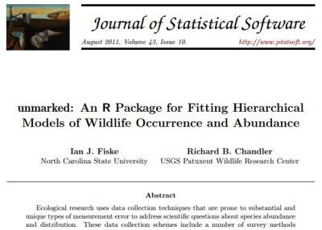
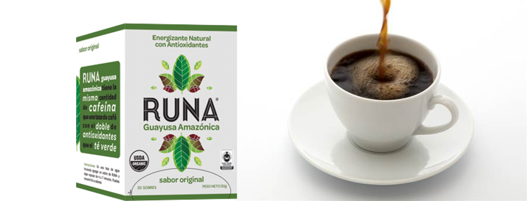

## [Unmarked](https://www.jstatsoft.org/article/view/v043i10)

### The quintessential package for fauna abundance and analysis.


> - Model occupation, abundance and density of unmarked animals.
> - Analogous to [Presence program](http://www.mbr-pwrc.usgs.gov/software/presence.html)
> - Contrast with the [Mark program](http://warnercnr.colostate.edu/~gwhite/mark/mark.htm)

---

## Tipos de modelos en unmarked:

> - Single-season site occupancy model (MacKenzie et al., 2002)
> - Royle-Nichols model (Royle and Nichols, 2003)
> - Binomial N-mixture models (Royle, 2004b)
> - Multinomial N-mixture models (Royle, 2004a)
> - Distance sampling models (Royle et al., 2004)
> - “Open population” versions of the above: (MacKenzie et al., 2003; Chandler
et al., 2011; Dail and Madsen, 2011)

---

## Basic model decision tree in the unmarked package


---

## Data structure and work flow


|        | visita 1| visita 2| visita 3| visita 4|
|:-------|--------:|--------:|--------:|--------:|
|sitio 1 |        1|        0|        0|        1|
|sitio 2 |        0|        0|        0|        0|
|sitio 3 |        1|        1|        0|        0|
|sitio X |        0|        0|        0|        0|

> - The sampling units are the sites
> - Ideally there should be at least 3 visits per site
> - The covariates ideally in another table.
> - Site covariates and observation covariates (several tables).
---

## Data structure

The three tables are linked in a special object called unmarkedFrame.


```r
umf <- unmarkedFrame (y = detections,
                      siteCovs = sitedata,
                      obsCovs = list(wind=viento, date=fecha))
```

---

## Simulation and example of the basic model.


## Example of the static model (Mackenzie 2002), a single season.

### Start a new project in Rstudio

Download the [code](https://gist.github.com/dlizcano/466eb0abc55c0957e441f091a7659330)

Download the [data](https://github.com/dlizcano/IntroOccuPresent/tree/gh-pages/data) and install in the data folder

---

## Example of analysis with covariates

vignette by unmarkedFrameOccu


```r
# Fake data
R <- 4 # number of sites
J <- 3 # number of visits
y <- matrix(c(1,1,0,0,0,0,1,1,1,1,0,1), nrow=R, ncol=J, byrow=TRUE)
site.covs <- data.frame(x1=1:4, x2=factor(c('A','B','A','B')))
obs.covs <- list(
   x3 = matrix(c(-1,0,1,-2,0,0,-3,1,0,0,0,0), nrow=R, ncol=J, byrow=TRUE),
   x4 = matrix(c(
      'a','b','c',
      'd','b','a',
      'a','a','c',
      'a','b','a'), nrow=R, ncol=J, byrow=TRUE))
umf <- unmarkedFrameOccu(y=y, siteCovs=site.covs, obsCovs=obs.covs) # organize data
umf                     # look at data
summary(umf)            # summarize      
fm <- occu(~1 ~1, umf)  # fit a model
```


---

## Download and install JAGS Program
## Packages: R2jags, spatstat, raster, rgeos, sp
> - In addition, You must bring a lot of enthusiasm and...
> - 


